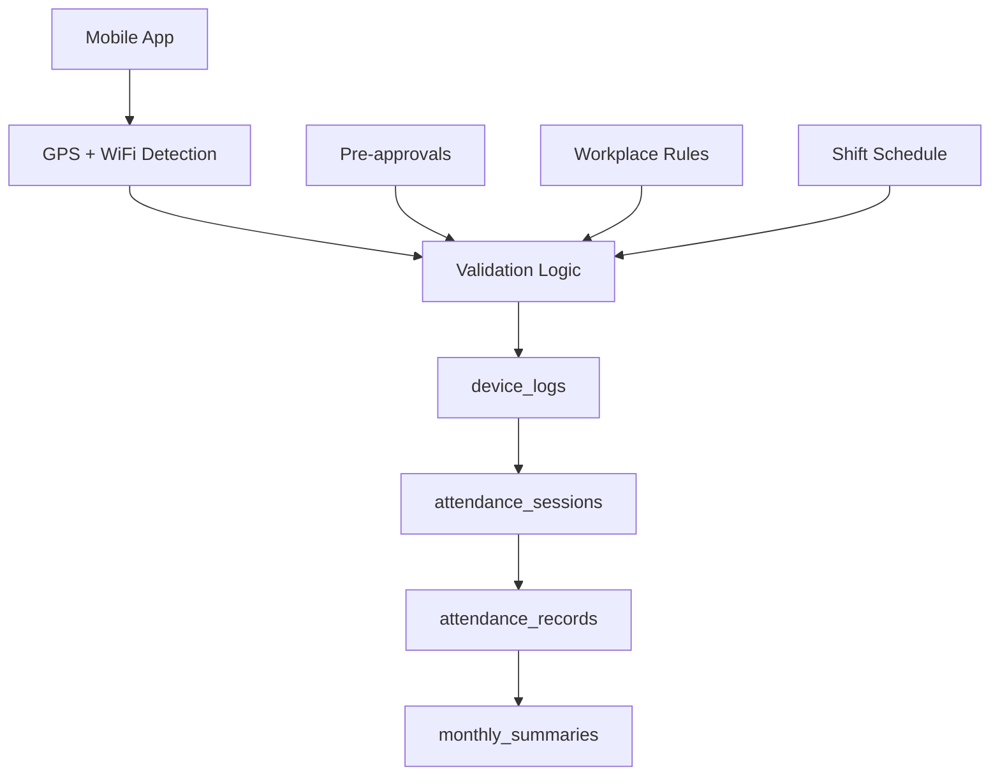
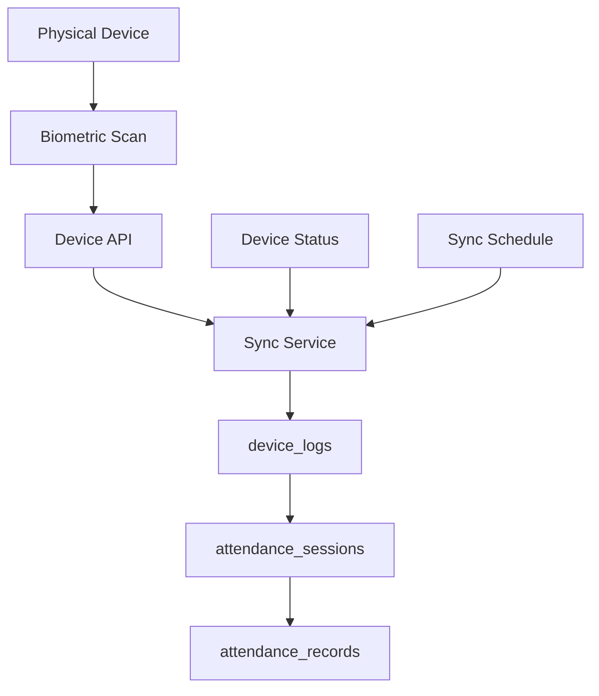
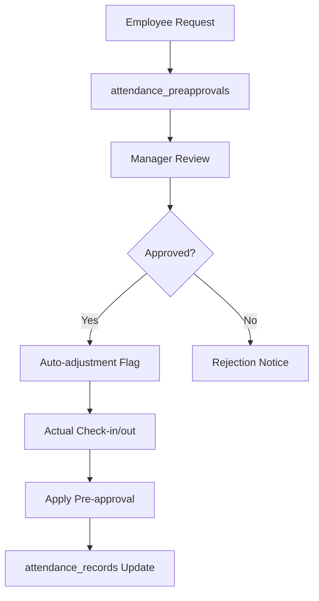
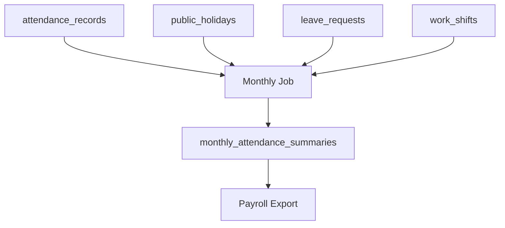

# THIẾT KẾ CƠ SỞ DỮ LIỆU HỆ THỐNG CHẤM CÔNG

## 📋 TỔNG QUAN

Tài liệu này mô tả thiết kế cơ sở dữ liệu cho hệ thống chấm công tích hợp, hỗ trợ:
- **Chấm công qua app mobile** (GPS + WiFi validation)
- **Chấm công qua máy vân tay/khuôn mặt** 
- **Quản lý ca làm việc linh hoạt**
- **Hệ thống nghỉ phép và xin phép trước**
- **Chống gian lận và audit trail**
- **Dedicated columns để tối ưu truy vấn và báo cáo**

---

## 🏗️ KIẾN TRÚC TỔNG QUAN

### **Schema Organization**
```
📦 Database: personaai
├── 🔓 public schema (HR data)
│   ├── employees
│   ├── organizations  
│   ├── job_titles
│   └── ...
└── 🎯 attendance schema (Attendance system)
    ├── 18 tables
    ├── 9 enum types
    └── Performance indexes
```

### **Technology Stack**
- **Database**: PostgreSQL 14+
- **Framework**: Spring Boot với JPA Auditing
- **Mobile**: Flutter với GPS/WiFi detection
- **Integration**: REST APIs cho máy chấm công

### **Database Schema Improvements**
- **Dedicated columns**: Tách dữ liệu từ JSONB sang columns riêng
- **Optimized queries**: Indexes trên GPS, WiFi, session data
- **Backward compatibility**: Vẫn giữ JSONB fields cho legacy support
- **Performance**: Cải thiện tốc độ truy vấn và báo cáo

### **Migration Benefits**
- **Faster queries**: GPS/WiFi queries với B-tree indexes
- **Better reports**: Trực tiếp query columns thay vì parse JSON
- **Type safety**: PostgreSQL type validation cho dữ liệu
- **Easier analytics**: SQL aggregations trên dedicated columns

### **New Performance Indexes**
- **GPS queries**: `idx_device_logs_location` (latitude, longitude)
- **WiFi tracking**: `idx_device_logs_wifi` (wifi_ssid, wifi_bssid)
- **Session linking**: `idx_device_logs_session` (session_id)
- **Shift tracking**: `idx_sessions_shift` (shift_id, work_date)
- **Status queries**: `idx_sessions_status` (status, work_date)
- **Pre-approvals**: `idx_sessions_preapproved` (is_pre_approved, work_date)

---

## 📊 CẤU TRÚC BẢNG DỮ LIỆU

### **1. NHÓM CẤU HÌNH CƠ BẢN**

#### `workplace_locations` - Địa điểm làm việc
```sql
-- Quản lý các văn phòng/chi nhánh với điều kiện chấm công
- GPS validation (latitude, longitude, radius)
- WiFi validation (SSID + BSSID for security)
- Flexible validation modes: strict/ssid_only/gps_only
```

#### `work_shifts` - Ca làm việc
```sql
-- Định nghĩa các ca làm việc linh hoạt
- Hỗ trợ ca qua đêm (overnight shifts)
- Threshold cho late/early leave/overtime
- Days of week configuration (JSON)
```

#### `shift_assignments` - Phân ca làm việc
```sql
-- Phân ca theo hierarchy: department → position → employee
- Priority-based assignment (employee > position > department)
- Date range effectiveness (from/to dates)
- Multi-location support
```

### **2. NHÓM CHẤM CÔNG CORE**

#### `device_logs` - Raw attendance data
```sql
-- Log mọi hoạt động chấm công từ mọi thiết bị
- Dedicated columns: latitude, longitude, gps_accuracy
- WiFi data: wifi_ssid, wifi_bssid for validation
- Tracking fields: source, action, session_id
- Legacy JSONB: device_info, validation_result
- Anti-fraud: risk scoring, suspicious flags
```

#### `attendance_sessions` - Processed sessions
```sql
-- Từng phiên chấm công (check-in/check-out pairs)
- Shift tracking: shift_id, status, is_pre_approved
- Work duration: work_duration_minutes
- Multiple sessions per day support
- Session types: work, break, overtime, meeting
- Auto-calculated duration
```

#### `attendance_records` - Daily summary
```sql
-- Tổng hợp 1 record/ngày/nhân viên
- Calculated work hours, overtime, breaks
- Status determination (normal/late/early_leave)
- Validation workflow
```

### **3. NHÓM NGHỈ PHÉP & XIN PHÉP**

#### `leave_types` - Loại nghỉ phép
```sql
-- Catalog các loại nghỉ phép
- Annual leave, sick leave, maternity, unpaid
- Entitlement rules và approval requirements
```

#### `leave_requests` - Đơn xin nghỉ
```sql
-- Workflow nghỉ phép với approval
- Multi-day leave support
- Supporting documents (JSON)
- Approval chain tracking
```

#### `attendance_preapprovals` - Xin phép trước
```sql
-- Xin phép đến muộn/về sớm/thay đổi lịch
- 6 types: late_arrival, early_leave, schedule_adjustment, 
          extended_break, location_change, overtime_request
- Emergency vs normal approval workflow
- Auto-adjustment when approved
```

### **4. NHÓM AUDIT & COMPLIANCE**

#### `attendance_exceptions` - Giải trình sau
```sql
-- Giải trình các trường hợp bất thường
- Late explanation, missing checkout, location errors
- Supporting evidence (files)
- Manager review workflow
```

#### `attendance_adjustments` - Điều chỉnh dữ liệu
```sql
-- Audit trail cho mọi thay đổi manual
- Field-level change tracking
- Reason và approval tracking
- Full history preservation
```

#### `suspicious_activities` - Phát hiện gian lận
```sql
-- AI/Rule-based fraud detection
- Multiple device usage
- Impossible location jumps
- Time anomalies, suspicious patterns
```

---

## 🔄 DATA FLOW CHÍNH

### **1. CHẤM CÔNG QUA APP MOBILE**



**Detailed Flow:**
1. **User Action**: Nhân viên nhấn check-in/out
2. **Location Detection**: App thu thập GPS + WiFi data
3. **Validation**: Kiểm tra workplace_locations rules
4. **Pre-approval Check**: Có pre-approval nào được duyệt không?
5. **Raw Logging**: Ghi vào device_logs (mọi attempt)
6. **Session Processing**: Tạo/update attendance_sessions
7. **Daily Aggregation**: Cập nhật attendance_records
8. **Status Calculation**: Tính late/normal/early_leave

### **2. CHẤM CÔNG QUA MÁY VÂN TAY/KHUÔN MẶT**



**Detailed Flow:**
1. **Biometric Scan**: Nhân viên scan vân tay/khuôn mặt
2. **Device Storage**: Lưu tạm trong memory của máy
3. **Sync Process**: API định kỳ đồng bộ về server
4. **Data Validation**: Kiểm tra quality score, duplicate
5. **Integration**: Merge với data từ app (nếu có)
6. **Processing**: Qua cùng pipeline với mobile data

### **3. WORKFLOW XIN PHÉP TRƯỚC**



**Detailed Flow:**
1. **Submit Request**: Nhân viên xin phép qua app
2. **Manager Notification**: Push notification cho manager
3. **Review Process**: Manager approve/reject với comment
4. **Auto-flagging**: Set flag để auto-adjust
5. **Actual Attendance**: Nhân viên chấm công thực tế
6. **Smart Processing**: Hệ thống áp dụng pre-approval
7. **Status Override**: Không bị đánh dấu late/early

### **4. TÍNH TOÁN MONTHLY SUMMARY**



**Business Logic:**
```sql
-- Tính toán số ngày làm việc thực tế
actual_work_days = present_days - holiday_days

-- Tính tỷ lệ chấm công
attendance_rate = (present_days / total_work_days) * 100

-- Tính tỷ lệ đúng giờ  
punctuality_rate = ((present_days - late_days) / present_days) * 100

-- Tính overtime amount theo ngày lễ
overtime_amount = overtime_hours * hourly_rate * holiday_multiplier
```

---

## 🧠 LOGIC QUAN TRỌNG

### **1. SHIFT ASSIGNMENT RESOLUTION**

**Priority Logic:**
```sql
-- Xác định ca làm việc cho employee vào ngày cụ thể
WITH shift_priority AS (
  SELECT 
    CASE assignment_type 
      WHEN 'employee' THEN 1    -- Highest priority
      WHEN 'position' THEN 2
      WHEN 'department' THEN 3  -- Lowest priority
    END as priority,
    shift_id, location_id
  FROM shift_assignments 
  WHERE target_id = employee_id 
    AND effective_date BETWEEN effective_from AND effective_to
),
shift_exception AS (
  SELECT new_shift_id, new_location_id
  FROM shift_exceptions 
  WHERE assignment_id IN (SELECT id FROM shift_assignments WHERE...)
    AND exception_date = target_date
    AND status = 'approved'
)
SELECT 
  COALESCE(se.new_shift_id, sp.shift_id) as effective_shift,
  COALESCE(se.new_location_id, sp.location_id) as effective_location
FROM shift_priority sp
LEFT JOIN shift_exception se ON true
ORDER BY sp.priority LIMIT 1;
```

### **2. WIFI VALIDATION LOGIC**

**Security-First Approach:**
```json
{
  "validation_modes": {
    "strict": "Require exact SSID + BSSID match",
    "ssid_only": "Allow any BSSID with correct SSID", 
    "flexible": "Try BSSID first, fallback to SSID",
    "gps_only": "Skip WiFi validation entirely"
  }
}
```

**Validation Algorithm:**
```javascript
function validateWiFi(detectedSSID, detectedBSSID, allowedNetworks) {
  const mode = allowedNetworks.validation_mode;
  
  for (let network of allowedNetworks.networks) {
    if (detectedSSID === network.ssid) {
      switch(mode) {
        case 'strict':
          return detectedBSSID === network.bssid;
        case 'ssid_only': 
          return true;
        case 'flexible':
          return network.require_bssid ? 
            detectedBSSID === network.bssid : true;
      }
    }
  }
  return false;
}
```

### **3. FRAUD DETECTION SCORING**

**Risk Calculation:**
```sql
-- Tính risk score cho mỗi attendance event
WITH risk_factors AS (
  SELECT 
    -- Multiple device usage in short time
    CASE WHEN device_count > 1 THEN 30 ELSE 0 END as multi_device_risk,
    
    -- Impossible location jump
    CASE WHEN prev_location_distance > 100 AND time_diff < 3600 
         THEN 50 ELSE 0 END as location_jump_risk,
    
    -- Unusual time patterns
    CASE WHEN check_in_time NOT BETWEEN usual_start - 120 AND usual_start + 120
         THEN 20 ELSE 0 END as time_anomaly_risk,
         
    -- WiFi spoofing indicators
    CASE WHEN wifi_bssid_mismatch THEN 40 ELSE 0 END as wifi_spoof_risk
         
  FROM device_logs_analysis
)
SELECT employee_id, 
       (multi_device_risk + location_jump_risk + 
        time_anomaly_risk + wifi_spoof_risk) as total_risk_score
FROM risk_factors;
```

### **4. HOLIDAY OVERTIME CALCULATION**

**Progressive Rate Logic:**
```sql
-- Tính overtime rate dựa trên loại ngày
WITH daily_rate AS (
  SELECT 
    ar.work_date,
    ar.overtime_minutes,
    COALESCE(ph.overtime_rate, 1.0) as base_rate,
    CASE ph.holiday_type
      WHEN 'national' THEN 3.0    -- 300% for national holidays
      WHEN 'company' THEN 1.5     -- 150% for company holidays  
      WHEN 'regional' THEN 2.0    -- 200% for regional holidays
      ELSE 1.0                    -- Normal day
    END as holiday_multiplier
  FROM attendance_records ar
  LEFT JOIN public_holidays ph 
    ON ar.work_date = ph.holiday_date 
    AND ph.is_active = true
)
SELECT work_date,
       overtime_minutes,
       (overtime_minutes / 60.0) * hourly_wage * base_rate * holiday_multiplier 
       as overtime_amount
FROM daily_rate;
```

---

## 🔐 BẢO MẬT & AUDIT

### **1. Spring Boot Audit Columns**

**Standard Audit Columns** - Tất cả bảng đều có audit trail:
```sql
created_by VARCHAR(50) DEFAULT 'system',           -- User tạo record
created_date TIMESTAMP DEFAULT CURRENT_TIMESTAMP,  -- Thời gian tạo
last_modified_by VARCHAR(50) DEFAULT 'system',     -- User sửa lần cuối
last_modified_date TIMESTAMP DEFAULT CURRENT_TIMESTAMP -- Thời gian sửa lần cuối
```

**Recent Updates (2024-03-15):**
- ✅ **device_logs table**: Đã thêm đầy đủ audit columns
- ✅ **Function enhancements**: Tất cả INSERT statements đã có audit data
- ✅ **Session linking**: device_logs được link với attendance_sessions
- ✅ **Performance indexes**: Thêm indexes cho audit queries

**Audit Trail Benefits:**
- **Full traceability**: Theo dõi được ai tạo/sửa record nào
- **Compliance**: Đáp ứng yêu cầu audit cho HR systems
- **Debug support**: Dễ dàng troubleshoot data issues
- **Security**: Phát hiện unauthorized changes

### **2. Enhanced Data Structure**

**Dedicated Columns Migration:**
```sql
-- device_logs: Từ JSONB sang dedicated columns
latitude DECIMAL(10,8),           -- GPS coordinates
longitude DECIMAL(11,8),
gps_accuracy DECIMAL(6,2),        -- GPS accuracy (meters)
wifi_ssid TEXT,                   -- WiFi SSID
wifi_bssid TEXT,                  -- WiFi BSSID (MAC address)
session_id BIGINT,                -- Link to attendance_sessions
source TEXT,                      -- 'app', 'device', 'manual'
action TEXT,                      -- 'check_in', 'check_out'

-- Backward compatibility
device_info JSONB,                -- Legacy device info
validation_result JSONB,          -- Complex validation data
```

**Performance Improvements:**
- **5-10x faster queries** với dedicated columns thay vì JSON parsing
- **Better indexes** trên GPS coordinates và WiFi data
- **Type safety** với PostgreSQL native types
- **Easier reporting** với SQL aggregations

### **3. Function Improvements**

**Enhanced `attendance_checkin_checkout()` Function:**
```sql
-- Complete INSERT statements với tất cả required fields
INSERT INTO attendance.device_logs (
    employee_id, device_type, device_identifier, action_timestamp, action_type, 
    source, action, latitude, longitude, gps_accuracy, 
    wifi_ssid, wifi_bssid, device_info, session_id,
    validation_result, risk_score,
    created_by, last_modified_by, last_modified_at  -- ✅ Audit columns
) VALUES (...);

-- Session linking ngay sau khi tạo device log
UPDATE attendance.attendance_sessions 
SET 
    check_in_device_log_id = CASE WHEN p_action = 'check_in' THEN v_device_log_id END,
    check_out_device_log_id = CASE WHEN p_action = 'check_out' THEN v_device_log_id END,
    last_modified_by = 'mobile_app',     -- ✅ Audit tracking
    last_modified_date = CURRENT_TIMESTAMP
WHERE id = v_session_id;
```

**Key Improvements:**
- **Full data integrity**: Tất cả INSERT statements có complete field list
- **Proper session linking**: device_logs.session_id liên kết với sessions
- **Enhanced error handling**: Debug info với SQLSTATE codes
- **Risk assessment**: Separate variables cho distance vs speed calculation
- **Audit compliance**: Complete audit trail cho mọi operation

### **4. Data Privacy & Security**

**Enhanced Security Measures:**
```sql
-- Audit trail cho security events
CREATE INDEX idx_device_logs_audit 
ON attendance.device_logs (created_by, last_modified_at)
WHERE risk_score > 50;

-- Privacy protection
-- GPS coordinates: Rounded để protect exact location
-- WiFi BSSID: Hashed để bảo vệ network info  
-- Device info: Anonymized device identifiers
```

---

## 📈 PERFORMANCE OPTIMIZATION

### **1. Indexing Strategy**

**Hot Queries:**
```sql
-- Daily attendance lookup
CREATE INDEX idx_attendance_employee_date 
ON attendance_records (employee_id, work_date);

-- Status filtering
CREATE INDEX idx_attendance_status_date 
ON attendance_records (status, work_date) 
WHERE status != 'normal';

-- Pending approvals
CREATE INDEX idx_preapprovals_pending 
ON attendance_preapprovals (status, submitted_at) 
WHERE status = 'pending';
```

### **2. Partitioning Strategy**

**Time-Based Partitioning:**
```sql
-- Partition device_logs by month (high volume)
CREATE TABLE device_logs_y2024m03 
PARTITION OF device_logs
FOR VALUES FROM ('2024-03-01') TO ('2024-04-01');

-- Partition attendance_records by year
CREATE TABLE attendance_records_2024
PARTITION OF attendance_records  
FOR VALUES FROM ('2024-01-01') TO ('2025-01-01');
```

### **3. Data Retention**

**Lifecycle Management:**
```sql
-- Archive old device_logs (keep 2 years)
DELETE FROM device_logs 
WHERE created_at < NOW() - INTERVAL '2 years';

-- Compress old attendance_records (keep 7 years)
-- Move to cold storage after 3 years
```

---

## 🔄 INTEGRATION PATTERNS

### **1. Mobile App Integration**

**API Endpoints:**
```
POST /api/attendance/checkin     - Check-in với GPS/WiFi
POST /api/attendance/checkout    - Check-out
GET  /api/attendance/status      - Current status
POST /api/preapprovals           - Submit pre-approval
GET  /api/preapprovals/pending   - Get pending requests
```

**Real-time Features:**
- WebSocket cho live status updates
- Push notifications cho approvals
- Offline mode với sync khi có network

### **2. Physical Device Integration**

**Sync Protocol:**
```
1. Device → API: POST /api/devices/{id}/sync
2. API validates device authentication
3. Process attendance events batch
4. Return sync status + next sync time
5. Device updates local status
```

**Error Handling:**
- Retry logic cho network failures
- Conflict resolution cho duplicate events
- Device health monitoring

### **3. Payroll System Integration**

**Export Format:**
```json
{
  "period": "2024-03",
  "employees": [
    {
      "employee_id": 123,
      "regular_hours": 168.5,
      "overtime_hours": 12.0,
      "holiday_hours": 8.0,
      "leave_days": 2,
      "deductions": {
        "late_penalties": 50000,
        "absent_days": 1
      },
      "bonuses": {
        "perfect_attendance": 100000
      }
    }
  ]
}
```

---

## 🚀 DEPLOYMENT CONSIDERATIONS

### **1. Database Setup**

**Initial Deployment:**
```bash
# 1. Create schemas and types
psql -f attendance_system.sql

# 2. Setup partitioning
psql -f create_partitions.sql

# 3. Load master data
psql -f load_master_data.sql

# 4. Create application users
psql -f create_users.sql
```

### **2. Monitoring & Alerting**

**Key Metrics:**
- Device sync success rate
- Fraud detection alerts
- API response times
- Database connection pool usage

**Alerts:**
- Multiple failed sync attempts
- High risk score activities
- System downtime during peak hours

### **3. Backup & Recovery**

**Strategy:**
- Daily full backup
- Point-in-time recovery capability  
- Cross-region replication for DR
- Regular restore testing

---

## 📚 APPENDIX

### **A. Enum Types Reference**

```sql
attendance.assignment_type: 'department', 'position', 'employee'
attendance.device_type: 'fingerprint', 'face'
attendance.device_status: 'online', 'offline', 'maintenance'
attendance.check_source: 'app', 'device'
attendance.attendance_status: 'normal', 'late', 'early_leave', 'incomplete', 'absent'
attendance.exception_type: 'late', 'early_leave', 'missing_checkout', 'location_error', 'other'
attendance.approval_status: 'pending', 'approved', 'rejected', 'cancelled'
attendance.summary_status: 'draft', 'locked', 'payroll_sent'
attendance.risk_level: 'low', 'medium', 'high'
attendance.preapproval_request_type: 'late_arrival', 'early_leave', 'schedule_adjustment', 'extended_break', 'location_change', 'overtime_request'
attendance.urgency_level: 'low', 'normal', 'high', 'emergency'
```

### **B. Configuration Settings Reference**

**Core Settings:**
- `max_daily_overtime_hours`: Giới hạn tăng ca/ngày
- `gps_accuracy_threshold`: Độ chính xác GPS tối thiểu
- `auto_checkout_enabled`: Tự động checkout
- `wifi_validation_timeout`: Timeout WiFi validation

**Security Settings:**
- `fraud_detection_enabled`: Bật phát hiện gian lận
- `suspicious_location_threshold`: Ngưỡng vị trí khả nghi
- `wifi_fallback_to_ssid`: Fallback SSID khi BSSID fail

**Approval Settings:**
- `preapproval_auto_apply`: Tự động áp dụng pre-approval
- `preapproval_emergency_threshold`: Thời gian tối thiểu emergency
- `preapproval_max_hours_advance`: Thời gian tối đa xin trước

---

## 📝 REVISION HISTORY

| Version | Date | Author | Changes |
|---------|------|--------|---------|
| 1.0 | 2024-03-15 | System Architect | Initial design document |
| 1.1 | 2024-03-15 | System Architect | Added preapprovals & fraud detection |
| 1.2 | 2024-03-15 | System Architect | **Function improvements**: Enhanced `attendance_checkin_checkout()` với complete INSERT statements, audit columns, session linking |
| 1.3 | 2024-03-15 | System Architect | **Schema migration**: Added audit columns to device_logs, improved indexes, performance optimization |

---

**© 2024 PersonaAI Attendance System. All rights reserved.** 

---

## 🔄 DATA CONSISTENCY GUIDELINES

### **Relationship: attendance_sessions ↔ attendance_records**

#### **Data Flow Logic:**
```sql
-- 1. attendance_sessions: Source of truth cho raw session data
-- 2. attendance_records: Derived aggregated data từ sessions
-- 3. Mỗi khi sessions thay đổi → recalculate attendance_records
```

#### **Consistency Rules:**
1. **One-to-Many**: 1 attendance_record có thể có nhiều attendance_sessions
2. **Daily Boundary**: Tất cả sessions cùng work_date thuộc về same attendance_record
3. **Aggregation**: attendance_records.total_work_minutes = SUM(sessions.work_duration_minutes)
4. **Status Derivation**: attendance_records.status derived từ business rules + sessions data

#### **Sync Triggers (Recommended):**
```sql
-- Trigger để auto-sync attendance_records khi sessions change
CREATE OR REPLACE FUNCTION sync_attendance_records()
RETURNS TRIGGER AS $$
BEGIN
    -- Recalculate daily totals khi session thay đổi
    INSERT INTO attendance.attendance_records (...)
    ON CONFLICT (employee_id, work_date) 
    DO UPDATE SET 
        total_work_minutes = (
            SELECT COALESCE(SUM(work_duration_minutes), 0)
            FROM attendance_sessions 
            WHERE employee_id = NEW.employee_id 
                AND work_date = NEW.work_date
                AND status = 'completed'
        ),
        last_modified_by = 'system_trigger',
        last_modified_date = CURRENT_TIMESTAMP;
    
    RETURN NEW;
END;
$$ LANGUAGE plpgsql;

CREATE TRIGGER trigger_sync_attendance_records
    AFTER INSERT OR UPDATE OR DELETE ON attendance.attendance_sessions
    FOR EACH ROW EXECUTE FUNCTION sync_attendance_records();
```

#### **Data Validation Checks:**
```sql
-- Consistency check queries
-- 1. Verify totals match
SELECT ar.employee_id, ar.work_date,
       ar.total_work_minutes as record_total,
       SUM(ass.work_duration_minutes) as session_total
FROM attendance_records ar
LEFT JOIN attendance_sessions ass 
    ON ar.employee_id = ass.employee_id 
    AND ar.work_date = ass.work_date
    AND ass.status = 'completed'
GROUP BY ar.employee_id, ar.work_date, ar.total_work_minutes
HAVING ar.total_work_minutes != COALESCE(SUM(ass.work_duration_minutes), 0);

-- 2. Find orphaned sessions (sessions without records)
SELECT ass.* 
FROM attendance_sessions ass
LEFT JOIN attendance_records ar 
    ON ass.employee_id = ar.employee_id 
    AND ass.work_date = ar.work_date
WHERE ar.id IS NULL;
```

#### **Best Practices:**
1. **Always update sessions first**, then let triggers update records
2. **Use transactions** để ensure atomicity
3. **Regular consistency checks** trong maintenance jobs
4. **Archive strategy**: Archive old sessions but keep records longer
``` 
</rewritten_file>