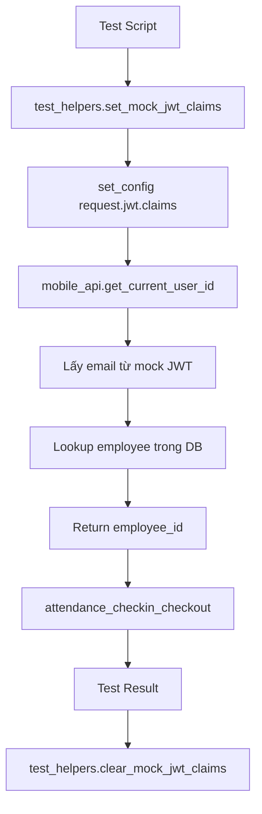

# 🎭 JWT Mock Testing cho Attendance System

## 🎯 Tổng quan

Hệ thống test này giải quyết vấn đề **JWT authentication** khi test hàm `attendance_checkin_checkout` trong môi trường PostgreSQL thuần (không qua PostgREST).

### 🤔 **Vấn đề gốc**
- Hàm `get_current_user_id()` lấy email từ `request.jwt.claims` 
- PostgREST set JWT claims khi có valid token
- Khi test trực tiếp trong PostgreSQL → **không có JWT claims** → authentication fail

### 💡 **Giải pháp JWT Mock**
- **Mock JWT Claims**: Giả lập `request.jwt.claims` bằng `set_config()`
- **Helper Functions**: Tự động set/clear JWT claims cho test
- **Wrapper Functions**: Test attendance với JWT mock tự động

## 🏗️ Kiến trúc JWT Mock System



## 📁 File Structure

```
docs/db/tests/attendance/
├── 00_setup_test_schema.sql              # Setup test data
├── test_jwt_mock_helpers.sql             # JWT mock functions
├── test_attendance_with_jwt_mock.sql     # Main test cases  
├── run_tests_with_jwt_mock.sh            # Test runner script
└── README_JWT_MOCK_TESTING.md            # This file
```

## 🚀 Quick Start

### **1. Chạy toàn bộ test suite**

```bash
cd docs/db/tests/attendance/
./run_tests_with_jwt_mock.sh
```

### **2. Chạy từng bước**

```bash
# Setup môi trường test
./run_tests_with_jwt_mock.sh -s

# Chỉ chạy tests (sau khi setup)
./run_tests_with_jwt_mock.sh -t

# Verify JWT mock hoạt động
./run_tests_with_jwt_mock.sh -v

# Cleanup test data
./run_tests_with_jwt_mock.sh -c
```

## 🛠️ JWT Mock Functions

### **1. Set Mock JWT Claims**

```sql
-- Set JWT claims cho employee
SELECT test_helpers.set_mock_jwt_claims('employee@personaai.com');

-- Bây giờ get_current_user_id() sẽ return employee_id tương ứng
SELECT mobile_api.get_current_user_id(); -- Returns employee ID
```

### **2. Clear Mock JWT Claims**

```sql
-- Clear JWT claims
SELECT test_helpers.clear_mock_jwt_claims();

-- Bây giờ get_current_user_id() sẽ return NULL
SELECT mobile_api.get_current_user_id(); -- Returns NULL
```

### **3. Test JWT Authentication**

```sql
-- Test JWT authentication functionality
SELECT * FROM test_helpers.test_jwt_authentication('test@personaai.com');
```

### **4. Test Attendance với Mock JWT**

```sql
-- Wrapper function tự động set/clear JWT
SELECT test_helpers.test_attendance_with_mock_jwt(
    'employee@personaai.com',
    'check_in',
    10.762622,  -- latitude
    106.660172, -- longitude
    5.0,        -- gps_accuracy
    'Office-WiFi',
    '00:11:22:33:44:55'
);
```

## 📋 Test Cases với JWT Mock

### **Authentication Tests**

| Test Case | Mô tả | JWT Mock | Kết quả mong đợi |
|-----------|-------|----------|------------------|
| TC-01 | Valid Employee | `test1@personaai.com` | `success: true` |
| TC-02 | No JWT Claims | `(cleared)` | `AUTH_REQUIRED` |
| TC-03 | Non-existing Employee | `nonexist@test.com` | `AUTH_REQUIRED` |
| TC-04 | Inactive Employee | `inactive@personaai.com` | `AUTH_REQUIRED` |

### **Attendance Function Tests**

| Test Case | Mô tả | JWT Mock | GPS | WiFi | Kết quả |
|-----------|-------|----------|-----|------|---------|
| TC-05 | Normal Check-in | Valid | ✅ | ✅ | `success: true` |
| TC-06 | Location Invalid | Valid | ❌ | ❌ | `LOCATION_INVALID` |
| TC-07 | Wrong WiFi | Valid | ✅ | ❌ | `LOCATION_INVALID` |
| TC-08 | Low GPS Accuracy | Valid | ❌ | ✅ | `GPS_ACCURACY_LOW` |

## 🔧 Cách hoạt động chi tiết

### **Step 1: Mock JWT Claims**
```sql
-- PostgreSQL internal storage
set_config('request.jwt.claims', '{"email":"test@personaai.com"}', false)
```

### **Step 2: Function sử dụng Mock**
```sql
-- Trong get_current_user_id()
v_user_email := current_setting('request.jwt.claims', true)::json->>'email';
-- v_user_email = 'test@personaai.com'
```

### **Step 3: Lookup Employee**
```sql
SELECT id FROM employees WHERE email = 'test@personaai.com' AND is_active = true;
-- Returns employee_id
```

### **Step 4: Test Attendance**
```sql
-- Attendance function nhận được employee_id từ JWT mock
SELECT mobile_api.attendance_checkin_checkout(...);
```

## 🧪 Manual Testing Examples

### **Example 1: Basic JWT Mock**

```sql
-- Manual test JWT mock
SELECT test_helpers.set_mock_jwt_claims('test1@personaai.com');
SELECT mobile_api.get_current_user_id(); -- Should return 1

-- Test attendance
SELECT mobile_api.attendance_checkin_checkout(
    'check_in', 10.762622, 106.660172, 5.0, 
    'Office-WiFi', '00:11:22:33:44:55', 
    '{"device_id": "TEST-001"}'
);

-- Cleanup
SELECT test_helpers.clear_mock_jwt_claims();
```

### **Example 2: Batch Testing**

```sql
-- Test multiple employees
SELECT * FROM test_helpers.batch_test_attendance(
    ARRAY['test1@personaai.com', 'test2@personaai.com'],
    'check_in'
);
```

### **Example 3: Session Management**

```sql
-- Test check-in then check-out
SELECT test_helpers.set_mock_jwt_claims('test1@personaai.com');

-- Check-in
SELECT mobile_api.attendance_checkin_checkout('check_in', 10.762622, 106.660172, 5.0, 'Office-WiFi', '00:11:22:33:44:55', '{}');

-- Check-out
SELECT mobile_api.attendance_checkin_checkout('check_out', 10.762622, 106.660172, 5.0, 'Office-WiFi', '00:11:22:33:44:55', '{}');

SELECT test_helpers.clear_mock_jwt_claims();
```

## ⚠️ Lưu ý quan trọng

### **1. Session Scope**
- Mock JWT claims chỉ tồn tại trong **session hiện tại**
- Mỗi PostgreSQL connection có JWT claims riêng
- Clear JWT claims sau mỗi test để tránh conflict

### **2. Test Data**
- Test employees: `test1@personaai.com`, `test2@personaai.com`
- Test workplace: GPS `10.762622, 106.660172` với radius 50m
- Test WiFi: `Office-WiFi` với BSSID `00:11:22:33:44:55`

### **3. Real vs Mock**
- **Production**: JWT claims từ PostgREST + real JWT token
- **Testing**: Mock JWT claims bằng `set_config()`
- Logic trong function **hoàn toàn giống nhau**

## 🔍 Debugging JWT Mock

### **Check JWT Claims Status**
```sql
-- Xem current JWT claims
SELECT current_setting('request.jwt.claims', true) as jwt_claims;

-- Test authentication
SELECT mobile_api.get_current_user_id() as current_user;
```

### **Verify Test Data**
```sql
-- Check test employees
SELECT id, name, email, is_active FROM employees WHERE id IN (1, 2, 999);

-- Check test workplace
SELECT * FROM attendance.workplace_locations WHERE id = 1;

-- Check shift assignments  
SELECT * FROM attendance.shift_assignments WHERE target_id IN (1, 2);
```

## 🚫 Troubleshooting

### **Lỗi: AUTH_REQUIRED**
```sql
-- Kiểm tra JWT claims có được set không
SELECT current_setting('request.jwt.claims', true);

-- Kiểm tra employee tồn tại không
SELECT * FROM employees WHERE email = 'your_test_email@personaai.com';
```

### **Lỗi: Function không tồn tại**
```sql
-- Kiểm tra schema path
SHOW search_path;

-- Set schema path
SET search_path TO mobile_api, attendance, public, test_helpers;
```

### **Lỗi: LOCATION_INVALID**
```sql
-- Kiểm tra GPS coordinates
SELECT ST_Distance(
    ST_GeogFromText('POINT(106.660172 10.762622)'),
    ST_GeogFromText('POINT(your_lng your_lat)')
) as distance_meters;
```

## 📊 Performance Benchmarks

Với JWT Mock system:
- **Setup time**: ~100ms (tạo schema + data)
- **Single test**: ~50ms (set JWT + run function + clear)
- **Batch test** (10 cases): ~500ms
- **Memory usage**: Minimal (chỉ lưu JWT string)

## 🎯 Best Practices

1. **Always Cleanup**: Clear JWT claims sau mỗi test
2. **Use Wrappers**: Prefer `test_attendance_with_mock_jwt()` over manual
3. **Reset Data**: Reset test data giữa các test cases
4. **Verify First**: Check JWT mock hoạt động trước khi test
5. **Error Handling**: Handle các edge cases (invalid email, inactive user)

---

**Happy Testing with JWT Mock! 🎭✨** 